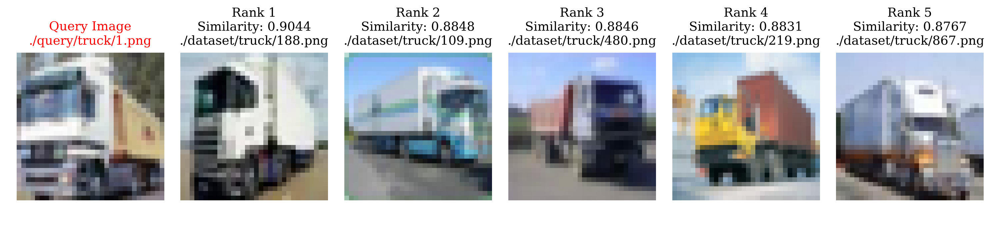

# ICE2607 Lab5: Searching by CNN Features

This project involves training a ResNet-20 model for image classification on the CIFAR-10 dataset and utilizing pre-trained ResNet-50 and ViT-B/16 models for image retrieval tasks on a custom dataset. Additionally, you can conduct retrieval operations on your own datasets.

## Example



## File Structure

- `src/`
    - `model.py`: Contains the ResNet-20 model implementation.
    - `train.py`: Script for training the ResNet-20 model.
    - `test.py`: Script for testing the ResNet-20 model checkpoint.
    - `retrieval.py`: Handles image retrieval tasks.
- `dataset/`: Custom dataset derived from CIFAR-10.
- `query/`: Default query images.
- `figures/`: Retrieval results and training visualizations.
- `final.pth`: Final model checkpoint with 90.930% accuracy on the test dataset.
- `Lab5_report.pdf`
- `README.md`
- `Makefile`
- `requirements.txt`

## Install

1. Ensure that you have Python installed on your system.

2. Clone or download this project and navigate to the project directory.

3. Check if the dependencies listed in `requirements.txt` are installed. If not, create a virtual environment (if necessary) and run `make install`.

## Usage

### Train ResNet-20 for Image Classification

```
python -m src.train \
    --lr 0.01 \
    --batch-size 128 \
    --epochs 50 \
    --optimizer AdamW \
    --weight-decay 0.01 \
    --step-size 40 \
    --augment False
```

Note:
- The provided values are the default hyperparameters.

### Test ResNet-20 checkpoints

```
python -m src.test final.pth
```

Note:
- Replace `final.pth` with path to your own checkpoint.

### Image Retrieval

```
python -m src.retrieval.py \
    --model resnet50 \
    --dataset-dir path/to/your/dataset \
    --target-dir path/to/your/query \
    --output-dir path/to/output/figures
```

Note:
- `target-dir` can be path to a query image or to folder of query images.
- Avoid duplicate filenames in `target-dir`.
- If the parameters are not specified, the program will default to use **./query** for target images, **./dataset** for dataset, and **./figures/results** for the output directory.